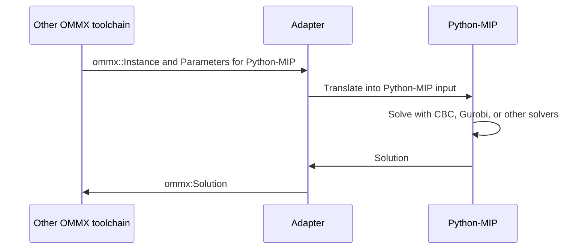

OMMX adaptor for Python-MIP
============================

This package provides an adaptor for the [Python-MIP](https://www.python-mip.com/) from/to [OMMX](https://github.com/Jij-Inc/ommx)

Python-MIP as a solver in OMMX toolchain
-----------------------------------------

Python-MIP as a user interface to create OMMX instance
-------------------------------------------------------
TBW
