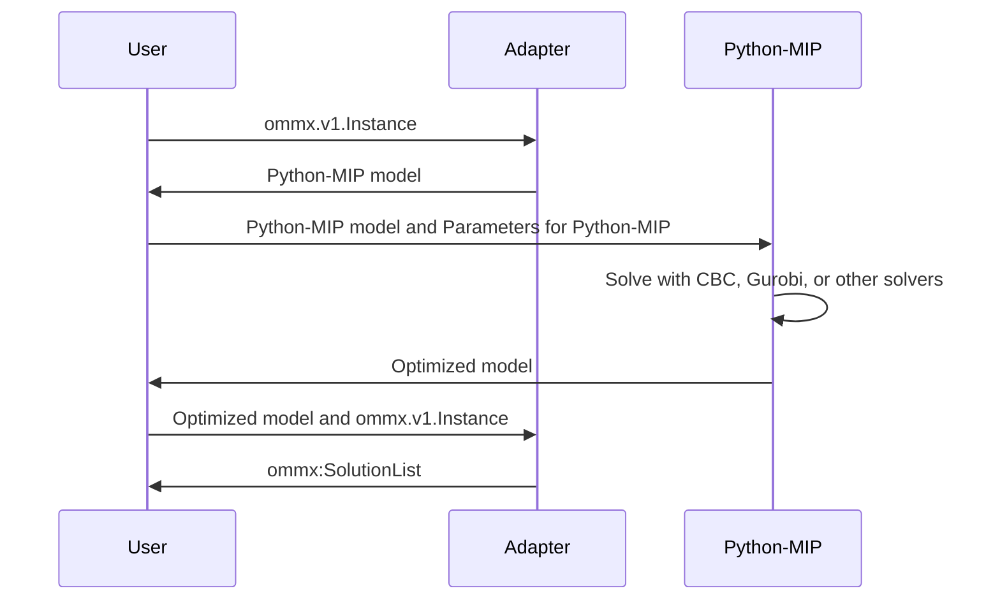
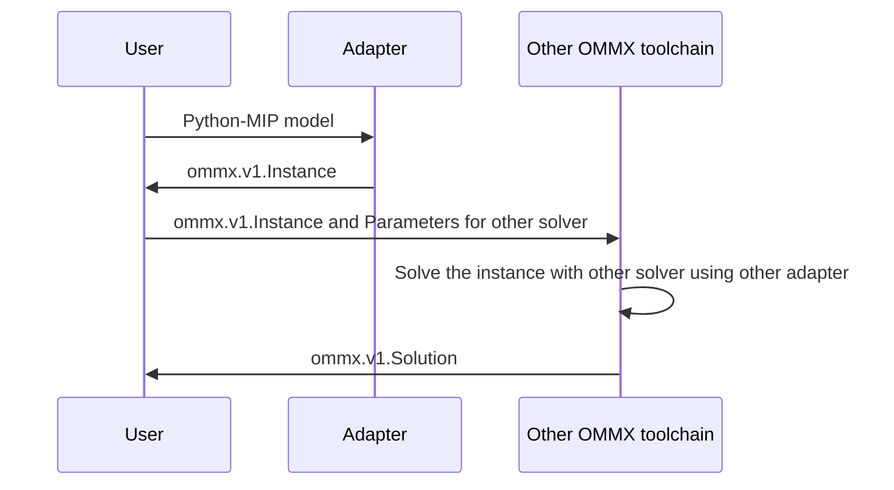

OMMX adaptor for Python-MIP
============================
[](https://pypi.org/project/ommx-python-mip-adapter/)

This package provides an adaptor for the [Python-MIP](https://www.python-mip.com/) from/to [OMMX](https://github.com/Jij-Inc/ommx)

Python-MIP as a solver in OMMX toolchain
-----------------------------------------


Python-MIP as a user interface to create OMMX instance
-------------------------------------------------------


Usage
======
`ommx-python-mip-adapter` can be installed from PyPI as follows:

```bash
pip install ommx-python-mip-adapter
```

Python-MIP can be used through `ommx-python-mip-adapter` by using the following:

```python markdown-code-runner
import ommx_python_mip_adapter as adapter
from ommx.v1.decision_variables_pb2 import DecisionVariable, Bound
from ommx.v1.instance_pb2 import Instance
from ommx.v1.function_pb2 import Function
from ommx.v1.linear_pb2 import Linear
from ommx.v1.solution_pb2 import SolutionList

ommx_instance = Instance(
    decision_variables=[
        DecisionVariable(
            id=1,
            kind=DecisionVariable.KIND_INTEGER,
            bound=Bound(lower=0, upper=5),
        ),
    ],
    objective=Function(
        linear=Linear(
            terms=[Linear.Term(id=1, coefficient=1)]
        ),
    ),
)
ommx_instance_bytes = ommx_instance.SerializeToString()

# Convert from `ommx.v1.Instance` to `mip.Model`
model = adapter.instance_to_model(ommx_instance_bytes)
model.optimize()
# Create `ommx.v1.SolutionList` from Optimized `mip.Model`
ommx_solutions_bytes = adapter.model_to_solution(
    model, ommx_instance_bytes
)

print(SolutionList.FromString(ommx_solutions_bytes))
```
You can get `ommx.v1.Instance` from a Python-MIP model as the following:
```python markdown-code-runner
import mip
import ommx_python_mip_adapter as adapter
from ommx.v1.instance_pb2 import Instance

model = mip.Model()
x1=model.add_var(name="1", var_type=mip.INTEGER, lb=0, ub=5)
x2=model.add_var(name="2", var_type=mip.CONTINUOUS, lb=0, ub=5)
model.objective = - x1 - 2 * x2
model.add_constr(x1 + x2 - 6 <= 0)

ommx_instance_bytes = adapter.model_to_instance(model)

print(Instance.FromString(ommx_instance_bytes))
```

Reference
==============
- [OMMX-Python-MIP-Adapter API Reference](https://jij-inc.github.io/ommx-python-mip-adapter/index.html)
