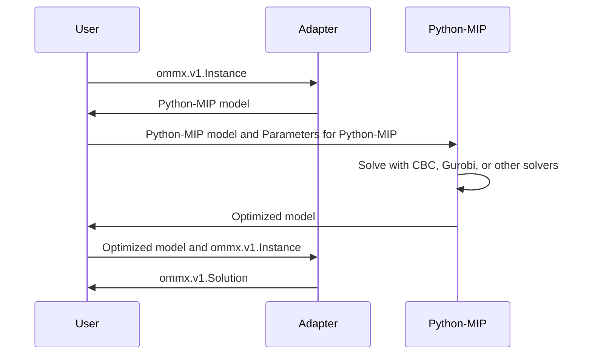
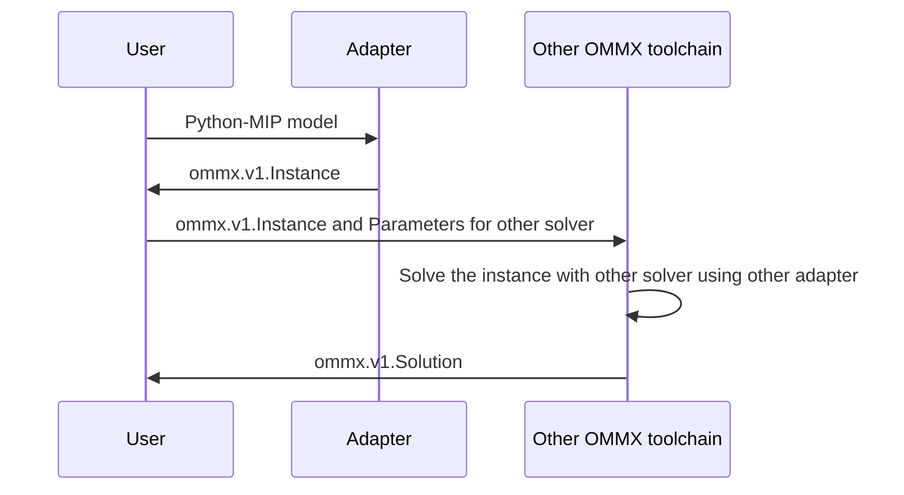

OMMX adapter for Python-MIP
============================
[](https://pypi.org/project/ommx-python-mip-adapter/)

This package provides an adapter for the [Python-MIP](https://www.python-mip.com/) from/to [OMMX](https://github.com/Jij-Inc/ommx)

Python-MIP as a solver in OMMX toolchain
-----------------------------------------


Python-MIP as a user interface to create OMMX instance
-------------------------------------------------------


Usage
======
`ommx-python-mip-adapter` can be installed from PyPI as follows:

```bash
pip install ommx-python-mip-adapter
```

Python-MIP can be used through `ommx-python-mip-adapter` by using the following:

```python markdown-code-runner
from ommx_python_mip_adapter import OMMXPythonMIPAdapter
from ommx.v1 import Instance, DecisionVariable

x1 = DecisionVariable.integer(1, lower=0, upper=5)
ommx_instance = Instance.from_components(
    decision_variables=[x1],
    objective=x1,
    constraints=[],
    sense=Instance.MINIMIZE,
)

# Create `ommx.v1.Solution` from the `mip.Model`
ommx_solution = OMMXPythonMIPAdapter.solve(ommx_instance)

print(ommx_solution)
```

You can get `ommx.v1.Instance` from a Python-MIP model as the following:

```python markdown-code-runner
import mip
import ommx_python_mip_adapter as adapter

model = mip.Model()
x1=model.add_var(name="1", var_type=mip.INTEGER, lb=0, ub=5)
x2=model.add_var(name="2", var_type=mip.CONTINUOUS, lb=0, ub=5)
model.objective = - x1 - 2 * x2
model.add_constr(x1 + x2 - 6 <= 0)

ommx_instance = adapter.model_to_instance(model)

print(ommx_instance)
```

Reference
==============
- [OMMX-Python-MIP-Adapter API Reference](https://jij-inc.github.io/ommx-python-mip-adapter/index.html)
